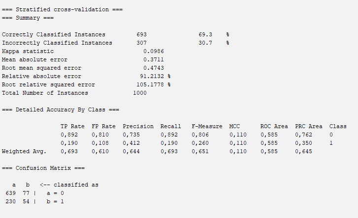
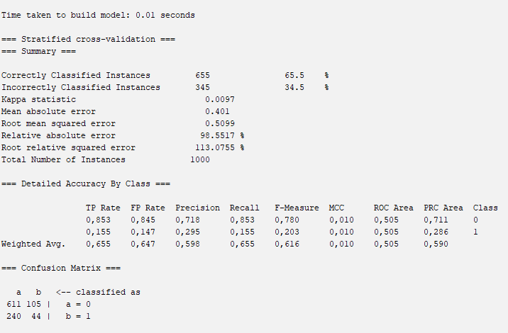
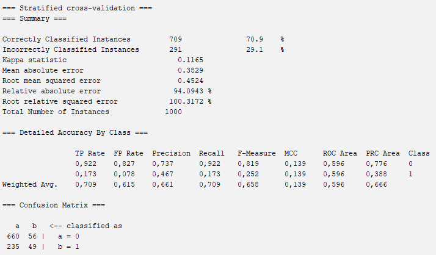
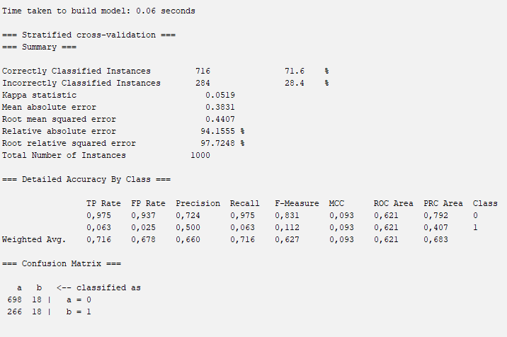

``` {r xaringan-logo, echo = FALSE, warning = FALSE} 
library(xaringanExtra)
use_logo(
  "img/dep/des.PNG",
  width = "125px",
  height = "135px",
  position = css_position(top = "3em", right = "5em"),
  link_url = NULL,
  exclude_class = c("title-slide", "inverse", "hide_logo")
)

```


``` {r xaringan-themer, include = FALSE}
library(xaringanthemer)
style_mono_accent(
  base_color = "#43418A"
)

```

```{r setup, include=FALSE}
options(htmltools.dir.version = FALSE)
```


# Introdução
A mineração de dados é uma área interdisciplinar que integra conceitos de estatística, ciência da computação e inteligência artificial com o objetivo de descobrir padrões, anomalias e correlações em grandes conjuntos de dados. Esta técnica é amplamente utilizada para transformar dados brutos em informações úteis e acionáveis.

# Objetivo

Prever se um determinado cliente irá ser default (1) ou não, através de determinadas técnicas de Machine Learning.

---

# Metodologia
Para este trabalho, serão utilizados 4 algoritmos: KNN, Multilayer Perceptron, Naive Bayes, Random Forest, Ada Boost.

---

# Descrição dos Dados  

*Salário*: representa o salário de determinado indivíduo (provavelmente, anual);  
*Economias*: representa a quantidade de economia;  
*Dívida*: representa o valor da dívida;  
*Roupa*: representa o total gasto em roupa nos últimos 12 meses;  
*Educação*: representa o total gasto em educação nos últimos 12 meses;  
*Entretenimento*: representa o total gasto em entretenimento nos últimos 12 meses;  
*Fines*: representa o total gasto em multas nos últimos 12 meses;  
*Apostas*: representa o total gasto em apostas nos últimos 12 meses;  
*Comestíveis*: representa o total gasto em comestíveis nos últimos 12 meses;  
*Saúde*: representa o total gasto em saúde nos últimos 12 meses;  
*Habitação*: representa o total gasto em habitação nos últimos 12 meses;  
*Impostos*: representa o total gasto em impostos nos últimos 12 meses;  
*Viagem*: representa o total gasto em viagens nos últimos 12 meses;  
*Serviços*: representa o total gasto em serviços nos últimos 12 meses.   
*DEFAULT*: cliente pagou ou não.

---

# Descrição dos Dados

``` {r, echo = FALSE, results = 'hide', warnings = FALSE, message = FALSE}
credit1 <- read.csv('credit_score3.csv', sep = ';')
```

```{r}
table(credit1$DEFAULT)
```  

---

# KNN

``` {r, echo = FALSE, results = 'hide', warnings = FALSE, message = FALSE}
credit1 <- read.csv('credit_score3.csv', sep = ';')
nrow(credit1)

credit1 <- subset(credit1, select = -c(CREDIT_SCORE,T_EXPENDITURE_12 ))

library(MVar.pt) 
library(Kira)


library(foreign)
sample = sample(2, nrow(credit1), replace = TRUE, prob = c(0.7,0.3))
data.train  = credit1[sample == 1,] # training data set
data.test   = credit1[sample == 2,] # test data set
class.train = as.factor(data.train$DEFAULT) # class names of the training data set
class.test  = as.factor(data.test$DEFAULT)  # class names of the test data set
rownames(data.train) <- NULL
rownames(data.test)  <- NULL
dim(data.train)
dim(data.test)
data <- credit1

r <- (ncol(data) - 1)
res <- Kira::knn(train = data.train[,1:r], test = data.test[,1:r], class = class.train, 
                 k = 1, dist = "euclidean", lambda = 5)
resp <- Kira::results(orig.class = class.test, predict = res$predict)
dat <- resp$roc.curve; tp = "roc"; ps = 3

```


```{r}
resp$res.class

```  

```{r}
resp$rate.hits
```

---

# Multilayer Perceptron

<center>

</center>  

---

# Naive Bayes 

<center>

</center>  

---

# Random Forest 

<center>

</center>  

---

# Ada Boost

<center>

</center>  


---

# Conclusões

É possível observar que o algoritmo de Ada Boost possui um acerto geral maior, sendo o que conseguiu maior precisão para a classe 1, a qual foi relativamente baixa para outros algoritmos.


