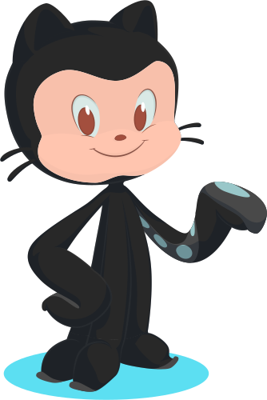

``` {r xaringan-logo, echo = FALSE, warning = FALSE} 
library(xaringanExtra)
use_logo(
  "img/dep/des.PNG",
  width = "125px",
  height = "135px",
  position = css_position(top = "3em", right = "5em"),
  link_url = NULL,
  exclude_class = c("title-slide", "inverse", "hide_logo")
)

```


``` {r xaringan-themer, include = FALSE}
library(xaringanthemer)
style_mono_accent(
  base_color = "#43418A"
)

```

```{r setup, include=FALSE}
options(htmltools.dir.version = FALSE)
```


# Introdução
Se é de amplo conhecimento que as bebidas alcóolicas fazem parte do dia-a-dia dos brasileiros, não a toa as festas as quais celebramos como natal, ano novo, páscoa, sempre envolvem essas bebidas.  
Quando se chega a fase universitária, não é diferente. Muitos jovens começam a beber nessa idade, indo as festas e, também, por conta das pessoas que o rodeiam. 

# Objetivo

A pesquisa atual tem por objetivo entender os padrões de consumo de álcool dos estudantes dos cursos de exatas. Para isso, foi aplicado um questionário com os estudantes dos cursos de ciência da computação, estística, física. informática, matemática e química.

---

# Metodologia
Através de Amostragem por Conveniência, foi-se se enviado e-mails para os estudantes dos cursos de interesse com um questionário no dia 18/10, e foi fechado dia 21/10, após a obtenção de 149 respostas.  <br><br>

O questionário continha perguntas como:
- Qual o curso da graduação você realiza?  <br>
- Você ingere bebidas alcóolicas?  <br>
- Você bebe álcool em quais situações?  <br>
- Caso beba, quantos em média você costuma gastar por mês com álcool?  <br>
- Caso beba, o que te leva a beber?  <br>


 

---

# Metodologia

Os dados foram extraídos de um arquivo `.csv`, o qual pode ser visto a seguir

```{r, warning = FALSE, echo=FALSE}
library(kableExtra)
load('dfkable.Rdata')
knitr::kable(head(df_kable)) %>% 
  kableExtra::kable_styling(font_size = 10)
```

???

Observação: nossos dados contém 12 colunas, portanto, o mostrado é uma pequena parte.
---
# Metodologia

A análise dos dados foram feitas com o pacote `ggplot2`, o qual é uma ferramenta muito útil para visualizações, e sua documentação está disponível no site a seguir: [ggplot](https://ggplot2.tidyverse.org). Os dados também têm inconsistências que precisam ser tratadas. Para a limpeza, foi-se utilizado o pacote `dplyr`, com documentação no site [dplyr](https://dplyr.tidyverse.org).  
Além disso, foi-se utilizado, também, o pacote `tm` (Text Mining), para a geração dos gráficos de núvem.
<center>
.pull-left[

]

.pull-right[

]
</center>

---

class: inverse, center, middle

<font size = "+6">Análise dos resultados</font>

---


```{r, echo = FALSE, out.width = "90%"}

load(file = 'testando2.Rdata')
load(file = 'curso.Rdata')
load(file = 'ingestao.Rdata')
load(file = 'ingestao_alcool.Rdata')
load(file ='realizaAtividade.Rdata')


```


# Curso

``` {r, echo = FALSE, out.width = "90%"}

plotly_curso


```

---

# Ingestão

``` {r, echo = FALSE, out.width = "90%"}

ingestao

```
 
---

# Atividade Remunerada

``` {r, echo = FALSE, out.width = "90%"}

atividade_remunerada

```


---


# Lugar onde bebe

```{r, echo = FALSE, out.width = "90%"}

load(file = 'testando2.Rdata')
load(file = 'curso.Rdata')
load(file = 'ingestao.Rdata')
load(file ='lugares.Rdata')
load(file ='siy.Rdata')
load(file ='frequenciaaaaa.Rdata')
load(file ='atividadeporfaixa.Rdata')
testeee1

```


---
# Sintomas

```{r, echo = FALSE, out.width = "90%"}

sintoms

```


---

# Ingestão de Álcool

```{r, echo = FALSE, out.width = "90%"}

fre

```


---

# Atividade por faixa etária

``` {r, echo = FALSE, out.width = "90%"}

atv_faixa

```

---

# Teste de hipóteses
No gráfico anterior, vemos a frequência das faixas de gastos por realização ou não de atividade remunerada, percebe-se que na última faixa, mais de 100 reais, há apenas indivíduos que realizam e na faixa 50 a 100 reais, a categoria que não realiza cai mais sua frequência relativamente. <br><br>

Para verificar se a diferença entre os grupos era estatiscamente significativa foi usado tanto o teste exato de Fisher, quanto o teste Qui-quadrado. Em ambos os teste com 95% de confiança a diferença entre os grupos não foi significativa.


| Teste       | p-value | Decisão              |
|-------------|---------|----------------------|
| Fisher      | 0.07909 | Não rejeitamos $H_0$ |
| Chi-Squared | 0.1045  | Não rejeitamos $H_0$ |

<br><br>


---


# Núvem de palavras

Na questão `O que te leva a beber?`, decidismo deixar a resposta em aberto, para podermos determinar se há algum padrão de comportamento. O resultado pode ser visto no seguinte Word Cloud.

``` {r, echo = FALSE, warning = FALSE, message = FALSE, out.width = "70%", fig.height = 5}
library(janitor)
library(ggplot2)
library(forcats)
library(tidyverse)
library(tm)
library(stringi)
library(wordcloud)
library(SnowballC)
library(plotly)

load(file = 'df4.Rdata')
df5 <- df4

df5$o_que_leva_a_beber <- str_replace_all(df5$o_que_leva_a_beber, 
                                          "[[:punct:]]", "") # retira acento
df5$o_que_leva_a_beber <- stri_trans_general(df5$o_que_leva_a_beber, "Latin-ASCII") # retira pontuação

df5 <- df5 %>% 
  mutate(
    o_que_leva_a_beber = tolower(o_que_leva_a_beber)
  ) # joga tudo pra lowercase

df5$o_que_leva_a_beber <- gsub("\\b(bebo|nao|geralmente|estar|apenas|loucona|porque|beber|algo|pra|bebida|cerveja|alcool|gostar)\\b", "", df5$o_que_leva_a_beber, ignore.case = TRUE)


corpus <- df5$o_que_leva_a_beber %>% 
  tm::VectorSource() %>% 
  Corpus()

corpus <- tm_map(corpus, content_transformer(tolower))
corpus <- tm_map(corpus, removePunctuation)
auxCorpus <- tm_map(corpus, removeWords, stopwords('pt')) 
auxCorpus <- tm_map(auxCorpus, stemDocument)
wordcloud(auxCorpus,max.words=20,colors=c("blue","red"))
```


---
# Código e disponibilidade

O código princiapl usado neste trabalho pode ser encontrado em [https://github.com/ghonoz/Amostragem/blob/main/main.R](https://github.com/ghonoz/Amostragem/blob/main/main.R). Sinta-se livre para copiar ou melhorar nosso código!  
<center>

</center>
---


# Referências


1. Morettin, Pedro Alberto, and Wilton Oliveira Bussab. Estatística básica. Saraiva Educação SA, 2017.

2. CAMPOS, Humberto. Estatística Experimental Não-Paramétrica. 4 Ed, Editora ESALQ,
Piracicaba,1983.


