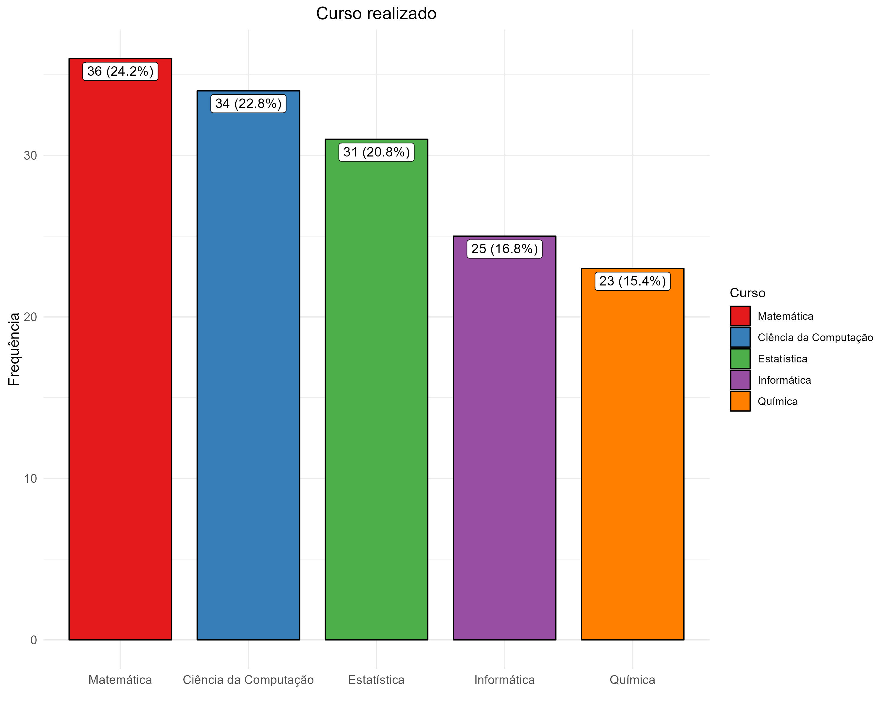
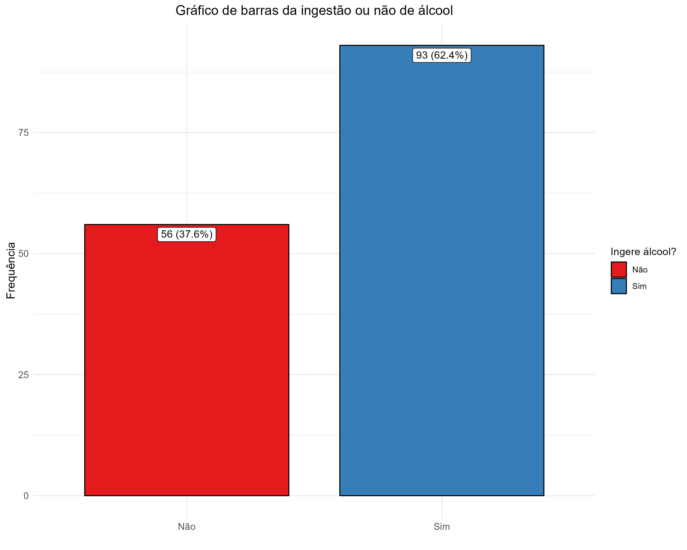
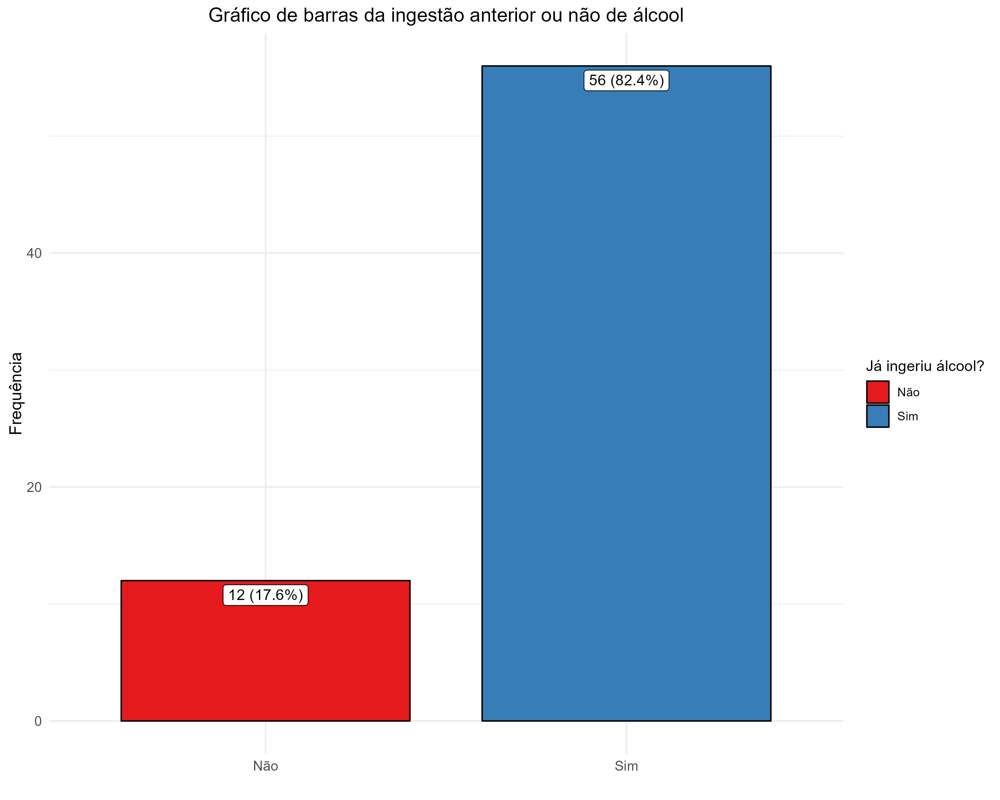
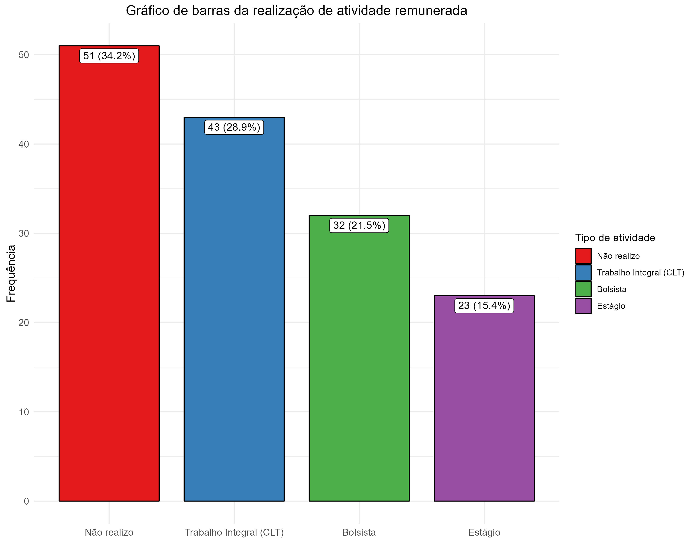

```{r setup, include=FALSE}
knitr::opts_chunk$set(echo = F, warning = F)
```

# 1. introdução

## 1.1 Sobre o questionário

# 2. Descrição da amostra

A amostra foi constituída de 149 observações de indivíduos dos cursos de ciência da computação, estatística, informática, matemática e química, com indivíduos que bebem, já beberam ou nunca beberam.
<br><br>


Por distribuição de curso, a amostra foi bem variada, tendo como principais respondentes os indivíduos do curso de matemática, mas todos os cursos constituíram pelo menos 15% da amostra. <br><br>



Quanto a ingestão de álcool, a maioria dos indivíduos bebe alguma bebida alcoólica .<br><br>


Daqueles que responderam que não ingerem álcool, aproximadamente 80% deles já ingeriram anteriormente, assim a amostra quase todas já teve contato com bebidas alcóolicas que é o objetivo da pesquisa.<br><br>


Na amostra temos que a maioria dos indivíduos realizam atividade remunerada, aproximadamente 65%, essa sendo dividida entre trabalhos, bolsas e estágios, no entanto, a não realizar atividades é uma fatia importante da amostra.<br><br><br><br>

# 3. Resultados

# 4. Conclusão

# 5. Referências