<style>
  body{
    text-align: justify;
  }
</style>


<br>
Gabriel Lopes Rubinho - RA: 125009 <br> Lorival Coelho Junior - RA: 124105
```{r setup, include=FALSE}
knitr::opts_chunk$set(echo = F, warning = F)
```

# 1. introdução

A pesquisa atual tem por objetivo entender os padrões de consumo de álcool dos estudantes dos cursos de exatas. Para isso, foi aplicado um questionário com os estudantes dos cursos de ciência da computação, estística, física. informática, matemática e química. <br><br>

## 1.1 Sobre o questionário

O questionário aplicado é constituído de 12 questões, sendo elas 9 com respostas fechadas, dessas duas com uma opção para o indivíduo discursar caso ele não se encaixe nas respostas pré definidas, além disso há 2 questões de múltipla escolha e por fim uma questão aberta e opcional para o respondente expressar uma visão pessoal. Esse questionário foi colocado no Google Forms e disparado a todos alunos dos cursos de exatas da UEM, o forms está a seguir:

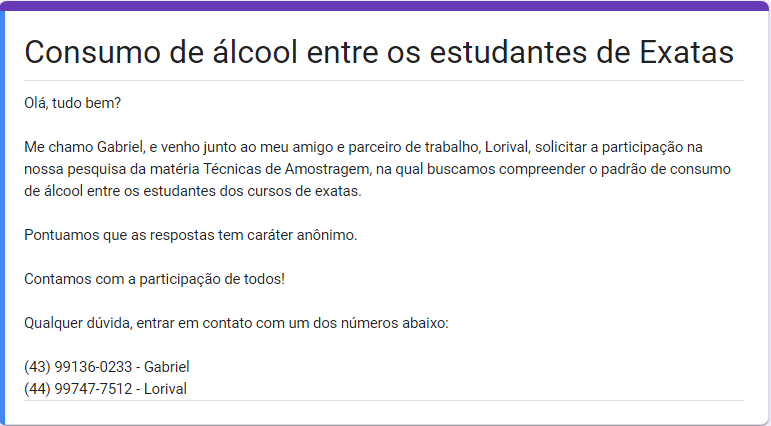
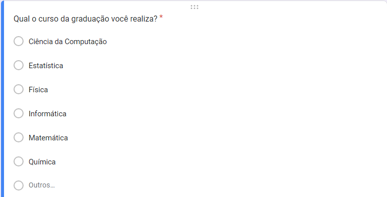
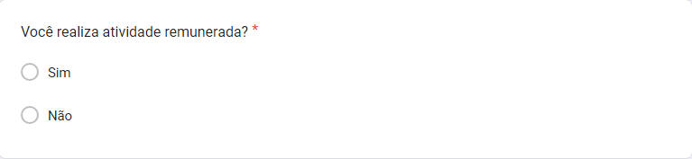
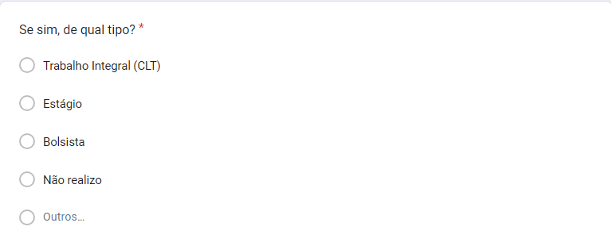
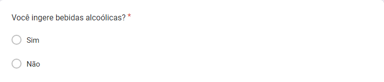
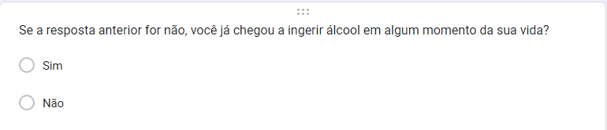
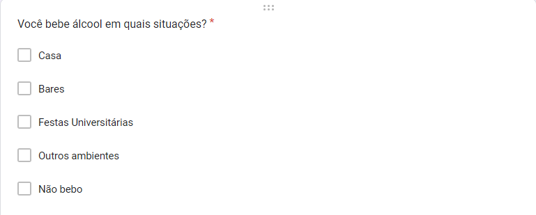
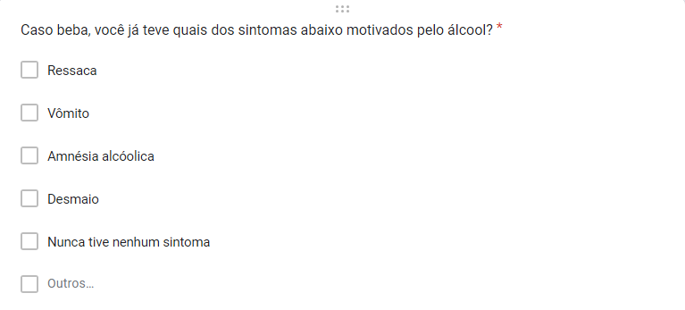
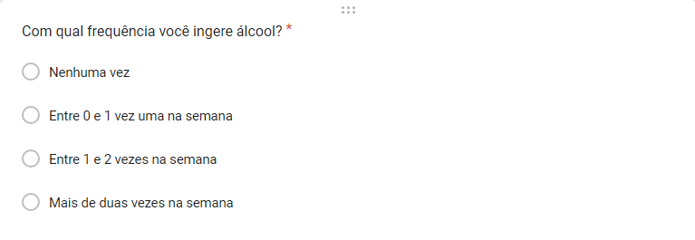
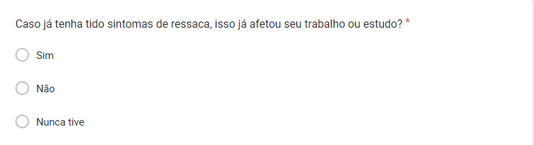
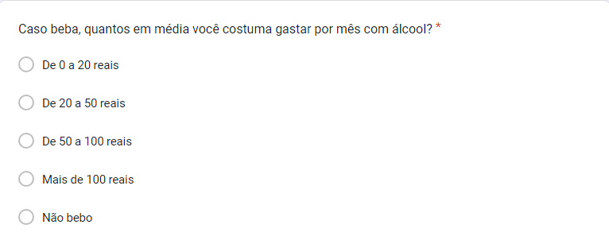
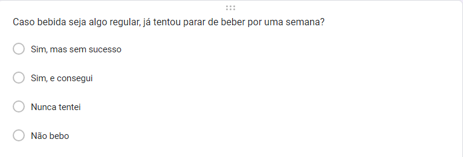
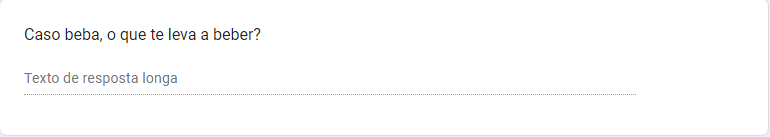

<br><br><br><br>


# 2. Descrição da amostra

A amostra foi obtida via amostragem por conveniênica, essa foi constituída de 149 observações de indivíduos dos cursos de ciência da computação, estatística, informática, matemática e química, com indivíduos que bebem, já beberam ou nunca beberam.
<br><br>


Por distribuição de curso, a amostra foi bem variada, tendo como principais respondentes os indivíduos do curso de matemática, mas todos os cursos constituíram pelo menos 15% da amostra. <br><br>


Quanto a ingestão de álcool, a maioria dos indivíduos bebe alguma bebida alcoólica .<br><br>


Daqueles que responderam que não ingerem álcool, aproximadamente 80% deles já ingeriram anteriormente, assim a amostra quase todas já teve contato com bebidas alcóolicas que é o objetivo da pesquisa.<br><br>


Na amostra temos que a maioria dos indivíduos realizam atividade remunerada, aproximadamente 65%, essa sendo dividida entre trabalhos, bolsas e estágios, no entanto, a não realizar atividades é uma fatia importante da amostra.<br><br><br><br>

# 3. Resultados

Algumas análises foram feitas para entender o comportamento dos dados de forma exploratória e também comparar certos grupos.
<br><br>

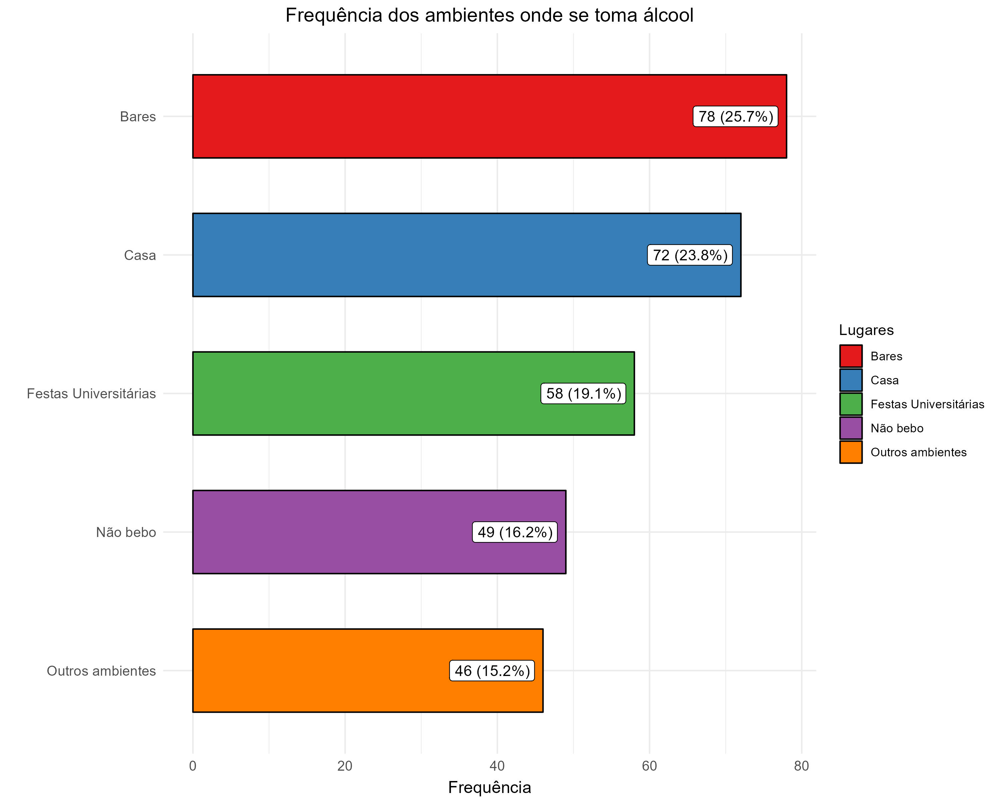
O gráfico acima, mostra que o local mais frequente onde os indivíduos consomem álcool são bares, seguido por casa, festas universitárias e por último outros ambientes que as opções não abordaram.<br><br>

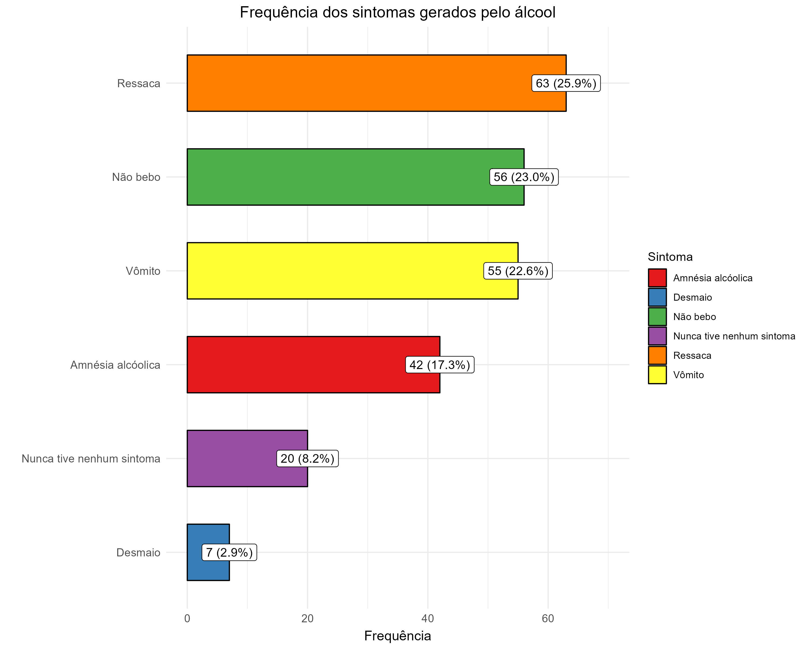
Quanto aos sintomas, temos que  o mais frequente é ressaca e o menos desmaio, quanto aos indivíduos que bebem, aproximadamente, 10% (ou 8% da amostra total) deles informaram que nunca tiveram nenhum dos sintomas citados.<br><br>

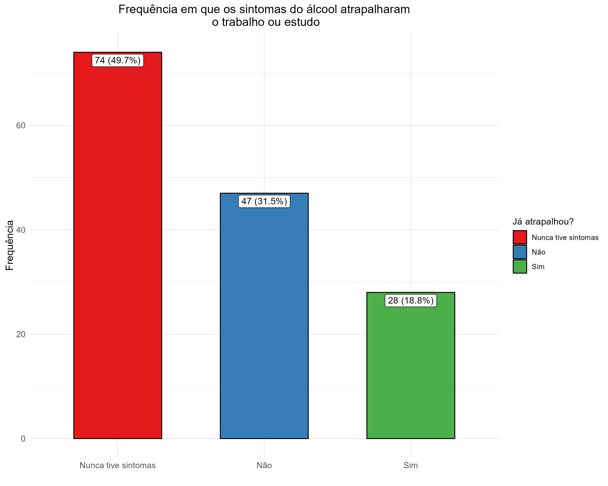
No gráfico acima vemos que, naqueles que bebem e já tiverem sintomas, a maioria não chegou a ter seu trabalho ou estudo atrapalhado pelos sintomas do álcool. <br><br>

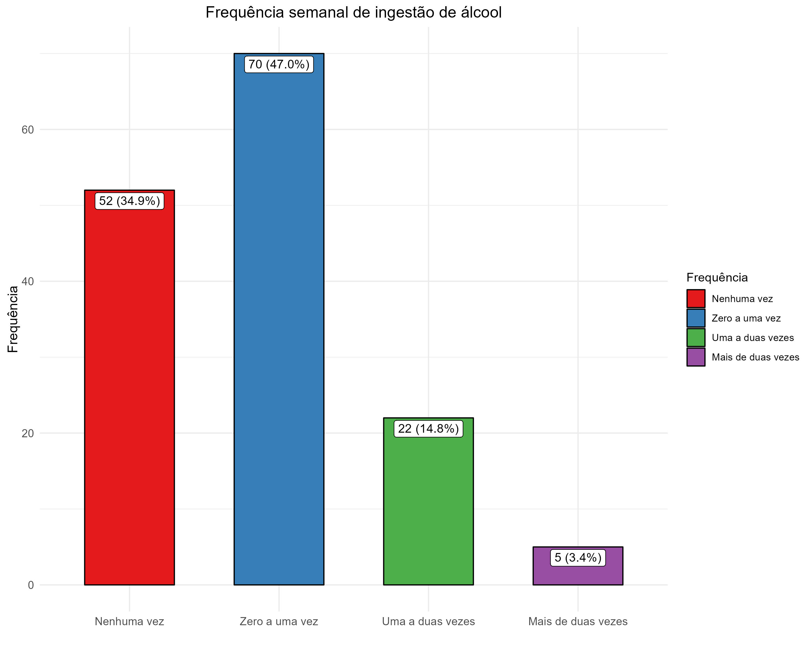
Para a frequência do consumo de álcool semanal, temos que a maioria dos indivíduos que consomem estão na faixa de zero a uma vez por semana, seguido a uma a duas vezes e com uma frequência bem baixa mais de duas vezes na semana.<br><br>


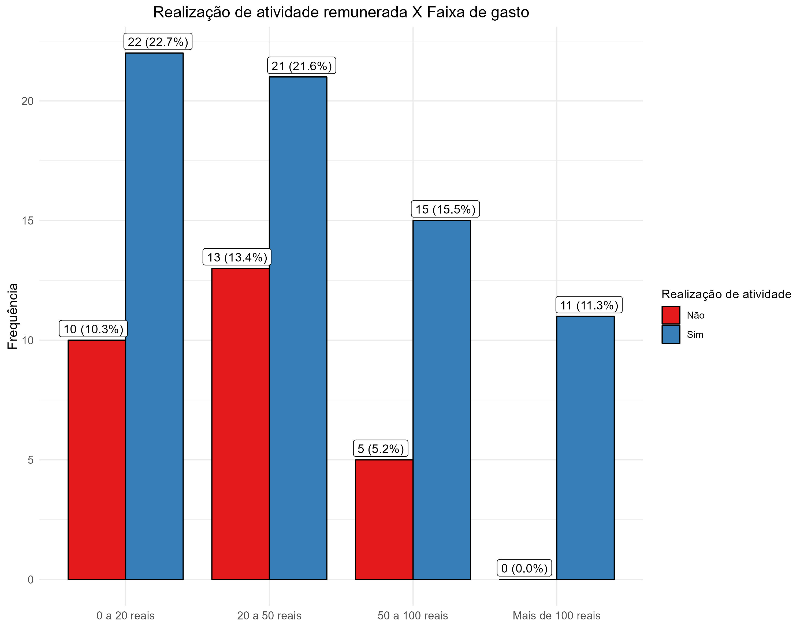
No gráfico acima vemos a frequência das faixas de gastos por realização ou não de atividade remunerada, percebe-se que na última faixa, mais de 100 reais, há apenas indivíduos que realizam e na faixa 50 a 100 reais, a categoria que não realiza cai mais sua frequência relativamente. <br><br>

Para verificar se a diferença entre os grupos era estatiscamente significativa foi usado tanto o teste exato de Fisher, quanto o teste Qui-quadrado. Em ambos os teste com 95% de confiança a diferença entre os grupos não foi significativa.


| Teste       | p-value | Decisão              |
|-------------|---------|----------------------|
| Fisher      | 0.07909 | Não rejeitamos $H_0$ |
| Chi-Squared | 0.1045  | Não rejeitamos $H_0$ |

<br><br>

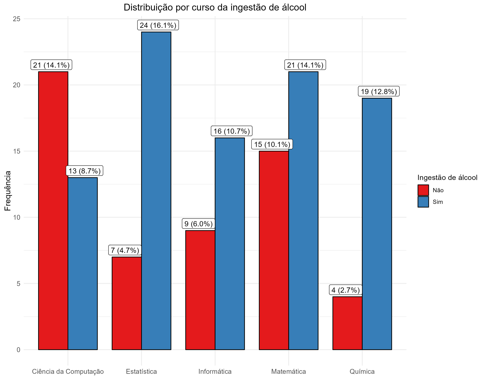
Na figura obeservamos que quase 40% daqueles que não bebem são de ciências da computação, enquanto os cursos de estatística e química estão bem desbalanceados entre as duas categorias tendo muito mais indivíduos que bebem, já para matemática e informática, mesmo a maioria bebendo as categorias estão mais balanceadas. <br><br>

Para testar se o perfil dos alunos de cada curso quanto a ingestão de álcool é estatísticamente significativa, foi realizado o teste de Fisher e Qui-quadrado, e em ambos temos um p-valor bem parecido, visto o tamanho das amostras em cada categoria da tabela de contingência, e rejeitamos $H_0$ utilizando 95% de confiança,

| Teste       | p-value  | Decisão          |
|-------------|----------|------------------|
| Fisher      | 0.003528 | Rejeitamos $H_0$ |
| Chi-Squared | 0.003404 | Rejeitamos $H_0$ | <br><br><br><br>

# 4. Conclusão
Enfim, após a análise das respostas do questionário podemos chegar a algumas conclusões: A maioria dos alunos dos cursos de exatas ingerem álcool, daqueles que não ingerem quase todos já ingeriram anteriormente. Quanto ao local onde é ingerido álcool por mais indivíduo é em bares. Para os sintomas gerados pelo álcool, 90% dos indivíduos que bebem já tiveram algum sintoma, sendo ressaca o mais comum, no entanto normalmente esses sintomas não atrapalham trabalho ou estudo. Quanto a frequência semanal de consumo de bebidas, o intervalo mais frequente é de zero a uma vez. Na amostra, apenas indivíduos que trabalham tiveram gasto médio maior que 100 reais mensal, independente se trabalha ou não a faixa mais frequente de gasto é de 0 a 50. Quanto a relação de curso e ingestão ou não de álcool, foi verificado que há diferença significativa, tendo o curso de Ciência da computação com mais indivíduos que não bebem e os curso de estatística e química com mais indivíduos que bebem.
<br><br><br><br>

# 5. Referências

1. Morettin, Pedro Alberto, and Wilton Oliveira Bussab. Estatística básica. Saraiva Educação SA, 2017.

2. CAMPOS, Humberto. Estatística Experimental Não-Paramétrica. 4 Ed, Editora ESALQ,
Piracicaba,1983.