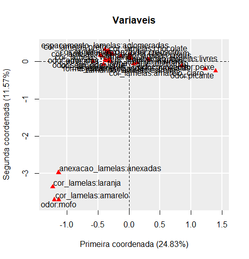
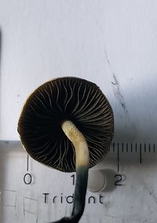
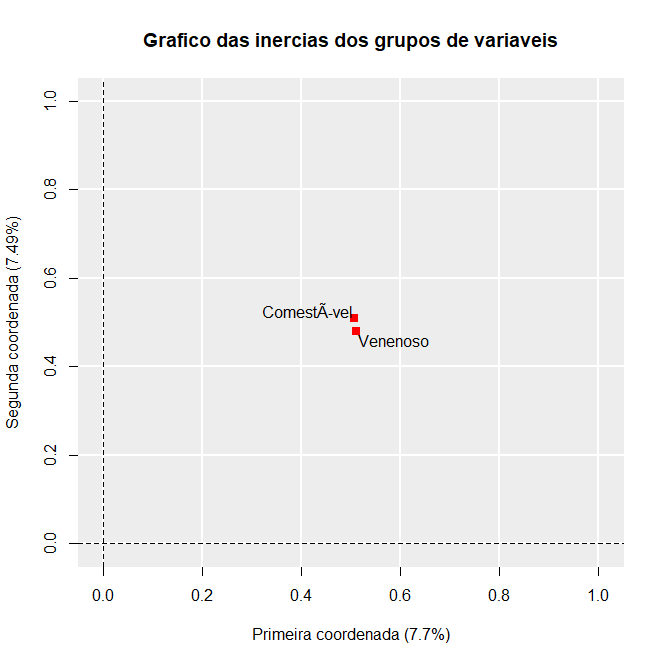

``` {r xaringan-themer, include = FALSE}
library(xaringanthemer)
style_mono_accent(
  base_color = "#43418A"
)

```

```{r setup, include=FALSE}
options(htmltools.dir.version = FALSE)
```


# Descrição dos Dados  

*Odor*: relativo ao cheiro do cogumelo;  
*Anexação Lamelas*: como as lamelas estão anexadas ao caule;  
*Espaçamento Lamelas*: o espaçamento entre as lamelas do cogumelo;  
*Tamanho das lamelas*: o tamanho das lamelas do cogumelo;  
*Cor das lamelas*: a cor das lamelas do cogumelo;
*Forma do caule*: a forma do caule do cogumelo;  
*Venenoso*: indica se o cogumelo é comestível ou não. 

Obs: a variável venenoso é classificatória, e foi usada somente no MFA. 

---


---


---
# Análise de correspondência múltipla  

```{r, echo = FALSE, warning=FALSE, message = FALSE}
library(knitr)
library(dplyr)
library(kableExtra)


dados <- read.csv("C:\\Users\\Pichau\\Documents\\Multivariada\\Trabalho 1\\Estat1\\mushrooms.csv")
dadoss <- dados[,-c(ncol(dados))]
kable(dadoss[, c(1,2, 3)], caption = "Tabela exemplo") %>%
  kable_styling(full_width = FALSE, position = "center")

```

---

```{r, warning=FALSE, message = FALSE}
library(MVar.pt)

dados <- read.csv("C:\\Users\\Pichau\\Documents\\Multivariada\\Trabalho 1\\Estat1\\mushrooms.csv")
res <- CA(dados, "c", typmatrix = "B")

```

```{r, echo = FALSE}
print("Existe dependencia entre as linhas e as colunas?"); res$depdata
```

```{r, echo = FALSE}

print("Numero de coordenadas principais:"); res$numcood

```

---

```{r, echo= FALSE}
print("Inercias das componentes principais:"); head(round(res$mtxAutvlr,2), 5)
```

---





---



---


# MFA

```{r, message = FALSE, warning = FALSE, echo=FALSE}
dados <- read.csv("C:\\Users\\Pichau\\Documents\\Multivariada\\Trabalho 1\\Estat1\\mushrooms.csv")

v <- dados[dados$venenoso == 'venenoso',-7]
c <- dados[dados$venenoso != 'venenoso',-7]
c <- sample_n(c,3916)
dados2 <- cbind(v,c)
dadoss <- head(dados2, 1000)
mf <- MFA(dados2, c(6,6), c('c','c'),namegroups = c('Venenoso', 'Comestível'))
```

```{r, echo = FALSE}
print("Variancias dos Componentes Principais:"); head(round(mf$mtxA,2))

```

---

```{r, echo =FALSE}
print("Matriz das Inercias Parciais/Escores das Variaveis:"); head(t(round(mf$mtxEV,2)), 5)
```

---



